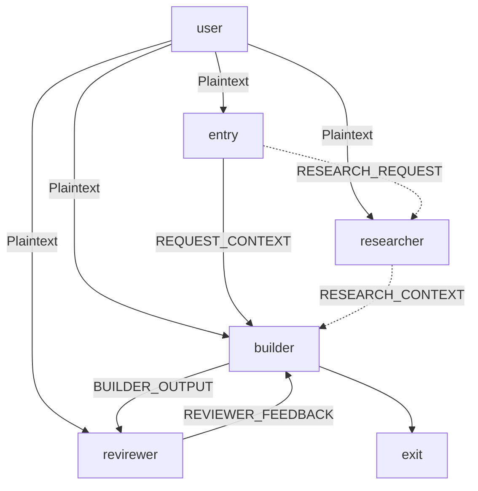

# Instructions

This is AI agents team focused on making changes on other git-managed products on the filesystem. 

It relies on product documentation available in product repository, but maintains own metadata for product file/folder structure and learnings from the tasks executed by the agents, which are not directly applicable to be documented in product repository.

## Repository structure

- .github/agents/*.agent.md: AI agents definitions
- .github/agents/resources/instructions: Technology and workflow specifics used by the AI agent to perform its activities
- .github/outputs/researcher - placeholder for any outut generated by `researcher` agent which is not stored only in the context.
- prodcuts.md - index of producs managed by the AI agents
- products/*.md - files with product specifics used by the AI agents
- exmaples - folder with example project and prompts. Registered as a product.

## Workflow

